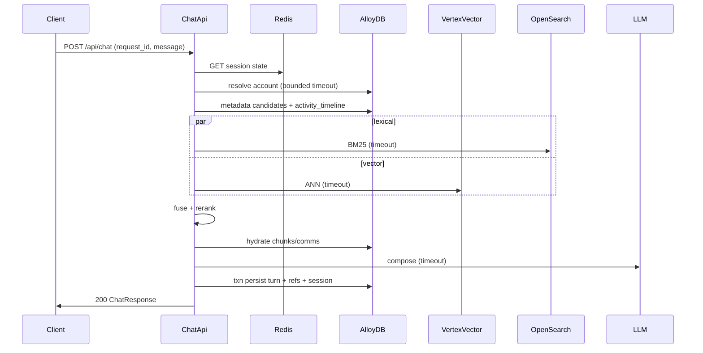
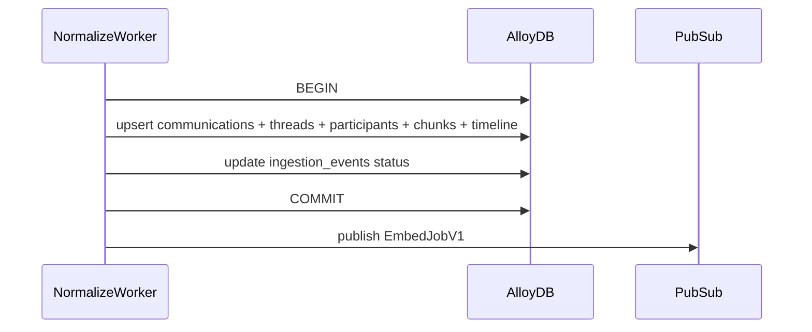
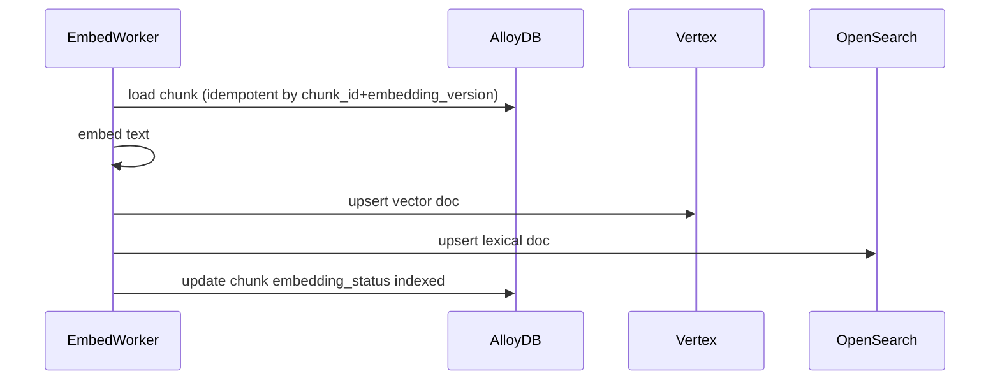
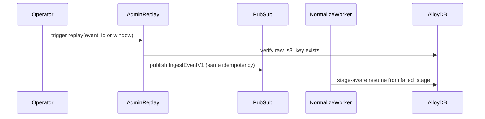
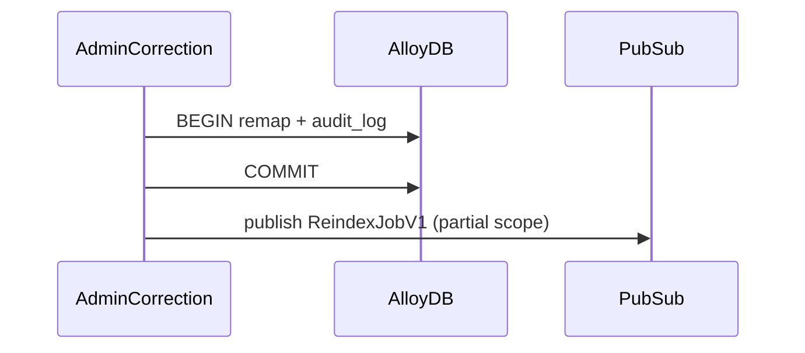
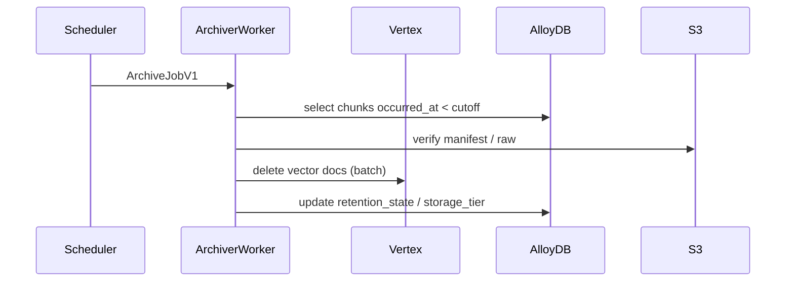
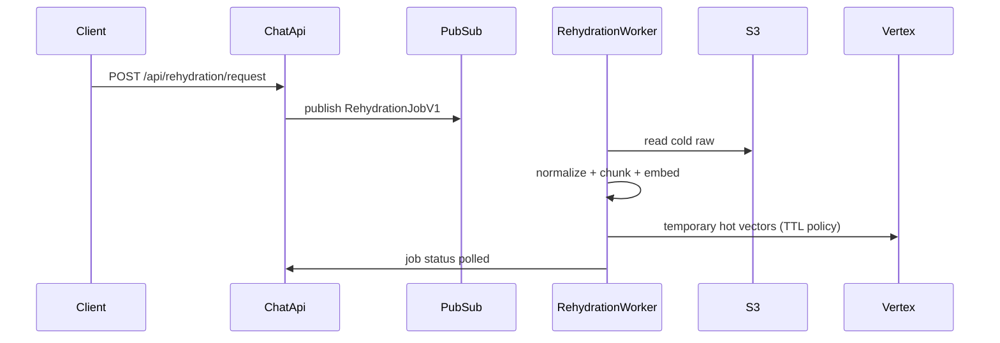

# Sequence diagrams (Mermaid)

## 1) Sync chat request (happy path)

## 2) Normalization transaction

## 3) Embed + index flow (LOCKED: vector + lexical in embed worker)

## 4) Replay flow

## 5) Correction / remap flow

## 6) Archiver flow

## 7) Rehydration flow

