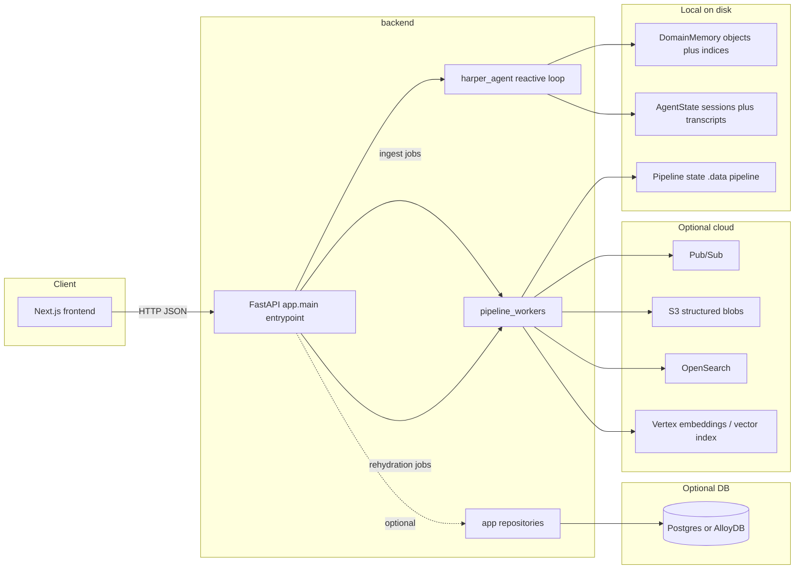
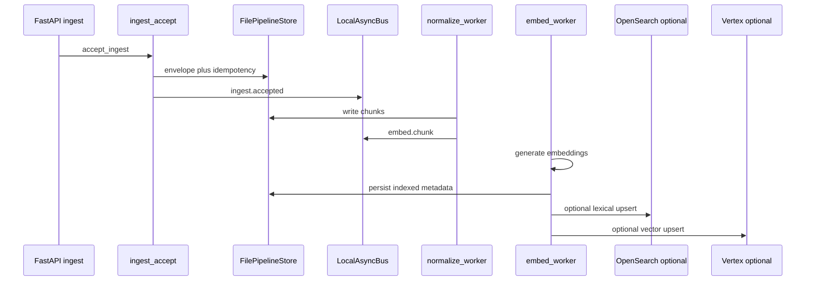

# SuperDay — code architecture

This document describes how the **SuperDay** repository is structured and how the main pieces interact at runtime.

**Code alignment:** Layout and behavior match this doc: `harper_agent` reads/writes `memory/{objects,indices,sessions,transcripts}/`; pipeline uses `backend/.data/pipeline/`; `/api/chat` does not call SQLAlchemy/AlloyDB. Key modules echo the same terms in docstrings (`app/api/chat.py`, `harper_agent/__init__.py`, `harper_bridge.py`, `pipeline/store.py`). **Security / auth / webhooks / rate limits:** see [`SECURITY_AND_COMMS.md`](SECURITY_AND_COMMS.md).

---

## Terminology (avoid overloading “memory”)

| Term | Meaning |
|------|---------|
| **Domain memory** | `memory/objects/` + `memory/indices/` — local file-backed knowledge used for resolver, profile/evidence hydration, and multi-index navigation. |
| **Agent runtime state** | `memory/sessions/` + `memory/transcripts/` — durable conversation/session state for the reactive agent (not the same as “vector memory” or domain facts). |
| **Pipeline state** | `backend/.data/pipeline/` — ingest/normalize/embed job envelopes, chunks, idempotency keys (file-backed until DB-backed pipeline exists). |

---

## Storage roles and source-of-truth boundaries

| Layer | Role |
|-------|------|
| **`memory/objects` + `memory/indices`** | Local **domain knowledge** for resolver + archival/evidence paths inside `harper_agent`. |
| **`memory/transcripts` + `memory/sessions`** | Local **runtime state** for agent conversations (replay, session JSON, turn history persistence). |
| **`backend/.data/pipeline`** | Local **pipeline job state** (accepted events, chunk files, embed progress). |
| **Postgres / AlloyDB** | Optional **structured app DB** (accounts, communications, chunks per `sql/001_schema.sql`) when you apply schema and wire repositories — **not** on the default chat hot path today. |
| **S3 / OpenSearch / Vertex** | Optional **cloud** structured object storage (see [`backend/docs/S3_KEY_LAYOUT.md`](../backend/docs/S3_KEY_LAYOUT.md)), lexical index, embeddings / vector index when env flags and clients are enabled ([`CLOUD_SETUP`](../backend/docs/CLOUD_SETUP.md)). |

**Local-first note:** In local/dev mode, **`memory/`** is the working knowledge and agent state store. In a fuller production deployment, **portions of this may be mirrored from or replaced by** DB- and cloud-backed services; nothing in the repo forces a single global “canonical” store yet — evolve explicitly per table/service.

---

## High-level system



- **Reactive chat:** **frontend → FastAPI `/api/chat` → `harper_bridge` → `harper_agent`** → reads **domain memory** and **agent runtime state** under `HARPER_MEMORY_ROOT` (default repo **`memory/`**).
- **Ingest / embed pipeline:** **POST `/api/ingest/*` → `ingest_accept` → local async bus + optional Pub/Sub, S3, OpenSearch, Vertex** ([CLOUD_SETUP](../backend/docs/CLOUD_SETUP.md)).
- **Reactive vs follow-up:** The **reactive agent** serves **synchronous user chat** (request/response on the chat API). The **follow-up agent** is an **asynchronous outbound workflow** (scheduled / queued) and is **not** on the chat critical path — see [FOLLOWUP_AGENT](../backend/docs/FOLLOWUP_AGENT.md).

---

## `harper_agent` and the database

**Current implementation is file-memory-first:** the reactive loop resolves accounts, loads evidence, and persists sessions/transcripts using **`memory/`** (paths above). **DB-backed resolution or retrieval for chat is not wired** in this codebase today; `app/repositories/` and SQL files are prepared for when AlloyDB/Postgres is applied and integrated into retrieval. Until then, treat **domain + runtime truth for chat** as **local files** under `memory/`.

---

## Current implementation status

| Area | Status |
|------|--------|
| FastAPI chat + history + transcript (via `harper_bridge`) | **Implemented** |
| `harper_agent` MemGPT loop + tools + file `memory/` | **Implemented** |
| Ingest accept + idempotency + local bus + file pipeline store | **Implemented** |
| Normalize + embed workers (local deterministic / stub vector) | **Implemented** (local path) |
| Rehydration worker (job file + short simulated completion) | **Partial** |
| OpenSearch / Vertex / S3 / Pub/Sub in `app/clients/` | **Partial** (boilerplate + env flags; vector upsert TODO in code) |
| AlloyDB/Postgres for app schema + chat retrieval | **Planned / optional** (schema + repos exist; not default chat path) |
| Archive / reindex workers | **Stub** |
| Follow-up worker (`followup.run`) | **Stub** |
| Redis session cache | **Planned** (setting only) |

---

## Current execution modes

| Mode | What runs | Typical use |
|------|-----------|-------------|
| **Local file-memory** | `harper_agent` + `memory/` only; pipeline may use `.data/pipeline` | Dev, demos, no cloud |
| **API** | `cd backend && uvicorn app.main:app` + optional `frontend` | Standard local full stack |
| **Cloud-assisted pipeline** | Same API + `HARPER_*` flags for S3, Pub/Sub, OpenSearch, Vertex | Staging / prod-shaped ingest |

Combinations: you can run **API + local memory** with **no** DB and **no** cloud; enabling cloud flags does not replace `memory/` for chat until you explicitly build that migration.

---

## Repository layout

```
SuperDay/
├── backend/                 # Single Python deployable (FastAPI + agent + workers)
│   ├── app/
│   │   ├── main.py          # FastAPI app, CORS, lifespan, worker startup
│   │   ├── api/             # HTTP routers
│   │   ├── core/            # settings, timeouts
│   │   ├── schemas/         # Pydantic: API + queue events (IngestEventV1, FollowupRunJobV1, …)
│   │   ├── models/          # SQLAlchemy models (subset of production schema)
│   │   ├── db/              # engine/session, SQL files under db/queries/
│   │   ├── repositories/    # DB access (e.g. account_repo) — optional until DB live
│   │   ├── services/        # harper_bridge, pipeline/, feature_resolution
│   │   ├── clients/         # GCP Pub/Sub, Vertex, AWS S3, OpenSearch, embedding orchestration
│   │   ├── workers/         # pipeline_workers
│   │   └── observability/   # placeholders for metrics/tracing
│   ├── harper_agent/        # MemGPT-style reactive agent
│   ├── sql/                 # DDL (001_schema.sql), bootstrap, maintenance
│   ├── specs/               # openapi.yaml
│   ├── infra/               # pubsub.yaml, cloudrun stubs (reference, not auto-applied)
│   ├── docs/                # CLOUD_SETUP, worker_contracts, FOLLOWUP_AGENT, diagrams
│   ├── scripts/             # e.g. ingest_smoketest.py
│   ├── requirements.txt
│   └── requirements-cloud.txt
├── frontend/                # Next.js UI (chat, calls backend HTTP API)
├── memory/                  # Local-first store (often gitignored): see subdirs below
│   ├── objects/             # domain payloads (e.g. accounts, people)
│   ├── indices/             # dimension indices for resolver/navigation
│   ├── sessions/            # agent runtime session JSON (harper_agent)
│   └── transcripts/         # durable turn log / replay (harper_agent)
├── tests/                   # Pytest — see note below
├── docs/                    # This file, ARCHITECTURE_MIGRATION.md
├── run_20_queries.py        # Spins up uvicorn from backend/, drives /api/chat
├── run_sample_queries.py    # In-process agent loop (no HTTP)
└── README.md
```

**Tests:** `tests/conftest.py` prepends **`backend/`** to `sys.path` so `import harper_agent` resolves the package next to `app/`. Tests assume **`backend/`** is the Python application root for agent imports (not the repo root).

---

## Backend HTTP surface (`backend/app/api/`)

| Router | Prefix | Role |
|--------|--------|------|
| `health` | `/healthz` | Liveness |
| `chat` | `/api` | `POST /chat`, stream, `GET /history`, `GET /transcript` → Harper agent via `harper_bridge` |
| `ingest` | `/api` | `POST /ingest/email|text|call_transcript`, `/ingest/batch` |
| `rehydration` | `/api` | `POST /rehydration/request` |
| `pipeline_status` | `/api` | `GET /pipeline/events/{id}`, rehydration job status |

---

## Reactive agent (`backend/harper_agent/`)

- **Entry for HTTP:** `harper_agent.main.run_agent_loop` (via `app/services/harper_bridge.py`).
- **Core loop:** `agent_loop.py` (LLM + tool execution + session updates).
- **Domain reads/writes:** `memory/objects/`, `memory/indices/` (resolver, archival, evidence).
- **Runtime state:** `memory/sessions/`, `memory/transcripts/`.

Distinct from **ingest/embed pipeline** and **follow-up agent**.

---

## Ingest → normalize → embed (pipeline)



Optional side paths (not in diagram): **S3** upload on accept when configured; **Pub/Sub** publish of `IngestEventV1` when `HARPER_PUBSUB_PUBLISH_INGEST` is set — see [CLOUD_SETUP](../backend/docs/CLOUD_SETUP.md).

---

## Background workers (`backend/app/workers/pipeline_workers.py`)

| Task | Bus topic | Purpose | Status |
|------|-----------|---------|--------|
| normalize | `ingest.accepted` | Chunk text, write chunk files, publish embed jobs | **Implemented** |
| embed | `embed.chunk` | Generate embeddings; persist metadata; optional OpenSearch / Vertex | **Partial** (cloud paths env-dependent) |
| rehydration | `rehydration.request` | Job file + simulated completion | **Partial** |
| archive | `archive.run` | Ack only | **Stub** |
| reindex | `reindex.run` | Ack only | **Stub** |
| followup | `followup.run` | Log only — see `FollowupRunJobV1` + [FOLLOWUP_AGENT](../backend/docs/FOLLOWUP_AGENT.md) | **Stub** |

### Worker startup (operations)

| Mode | When to use |
|------|-------------|
| **In-process** | Workers start inside **FastAPI lifespan** when `HARPER_START_BACKGROUND_WORKERS=true` (default). **Suitable for local/dev and simple single-process deployments.** |
| **Standalone** | `cd backend && python -m app.workers.pipeline_workers` — **recommended when scaling workers independently** (separate Cloud Run service / replicas) so ingest API and heavy consumers are not coupled. |

---

## Configuration and `.env` precedence

- **Template:** `backend/.env.example`
- **Loading:** `backend/app/main.py` calls `load_dotenv` for **repo root** `.env` first, then **`backend/.env`**. With **`python-dotenv`** default behavior (`override=False`), a key **already placed in `os.environ` by the first file is not replaced** by the second. **Shell-exported variables win** over both files.

**Practical rule:** For duplicate keys, **repo root `.env` wins over `backend/.env`** (root is loaded first; the second `load_dotenv` does not override by default). Prefer **a single repo root `.env`** for local dev. **Production:** inject env via the platform (Cloud Run, Secret Manager, etc.).

---

## Data stores (summary table)

| Store | Location / tech | Used by |
|-------|------------------|---------|
| Domain memory | `memory/objects/`, `memory/indices/` | `harper_agent` retrieval/resolver |
| Agent runtime state | `memory/sessions/`, `memory/transcripts/` | `harper_agent` |
| Pipeline state | `backend/.data/pipeline/` | ingest/normalize/embed |
| Application DB | Postgres/AlloyDB | repositories when schema applied |
| Redis | optional `HARPER_REDIS_URL` | reserved |

---

## Related docs

- [ARCHITECTURE_MIGRATION.md](./ARCHITECTURE_MIGRATION.md) — how to run API + frontend
- [backend/README.md](../backend/README.md) — backend quick start and ingest notes
- [backend/docs/FOLLOWUP_AGENT.md](../backend/docs/FOLLOWUP_AGENT.md) — follow-up agent plan
- [backend/docs/worker_contracts.md](../backend/docs/worker_contracts.md) — worker behavior contracts
- [backend/docs/CLOUD_SETUP.md](../backend/docs/CLOUD_SETUP.md) — GCP/AWS/DB env checklist
- [backend/docs/S3_KEY_LAYOUT.md](../backend/docs/S3_KEY_LAYOUT.md) — S3 tenant-scoped key conventions

---

## Design intent (short)

- **One backend folder** (`backend/`) for a single product; **frontend** stays separate.
- **Reactive** chat stays in **`harper_agent`**; **batch/async** ingestion and **follow-up** use queue-shaped messages and workers.
- **Production** data planes (AlloyDB, Pub/Sub, S3, OpenSearch, Vertex) are **wired progressively** via `app/clients/` and env flags.
